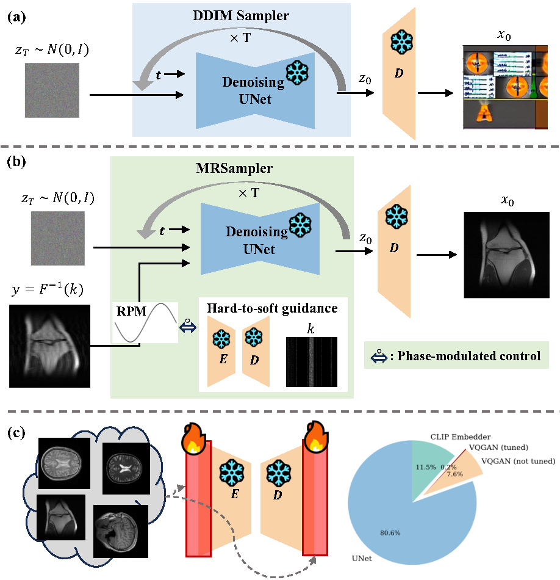

# MRPD

Official implementation of "MRPD: Undersampled MRI Reconstruction by Prompting a Large Latent Diffusion Model Trained on Vast Natural Images" by Ziqi Gao and S. K. Zhou.

This repo is still under construction and contains some draft code for the basic reproducibility. 


<p align="center"></p>


## Validation Data

We put the first volume in the official validation set of the single-coil FastMRI knee dataset inside `data/example/val` folder. Note that the last number denotes the slice number, and that the first five and the last five noisy slices are removed as stated in the paper.


## Repository Structure
All the experiments are issued in the form of self-explanatory `python` codes. To execute each code, we provide python scripts inside `stable-diffusion/scripts/` folder. You can run  `python inverse_fastMRIknee_recon.py --ckpt [LDM_CHECKPOINT_PATH]` for the validation set reconstruction. Currently you can download the LDM checkpoints from [Latent Diffusion](https://github.com/CompVis/latent-diffusion).

## Credits
This codebase is modified based on [PSLD](https://github.com/LituRout/PSLD). Thanks for creating this awesome repo.

We are also thankful for the developers of the following repositories: [Latent Diffusion](https://github.com/CompVis/latent-diffusion) for generative foundation model's pretrained weights; [FastMRI](https://github.com/facebookresearch/fastMRI) and [Score-MRI](https://github.com/HJ-harry/score-MRI) for some MRI helper functions.


## Citation

If you find this work helpful, please consider citing
```
@misc{gao2024mrpd,
      title={U$^2$MRPD: Unsupervised undersampled MRI reconstruction by prompting a large latent diffusion model}, 
      author={Ziqi Gao and S. Kevin Zhou},
      year={2024},
      eprint={2402.10609},
      archivePrefix={arXiv},
      primaryClass={eess.IV},
      url={https://arxiv.org/abs/2402.10609}, 
}
```

## To-do
Clean unecessary files and code inherited from PSLD.